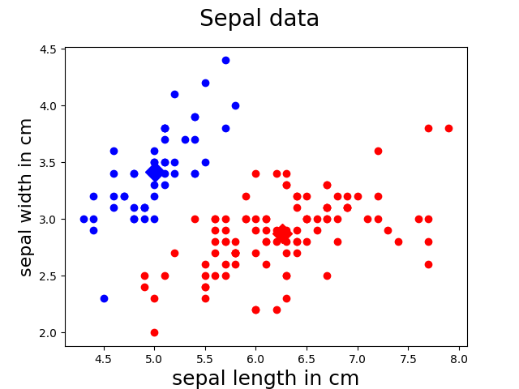
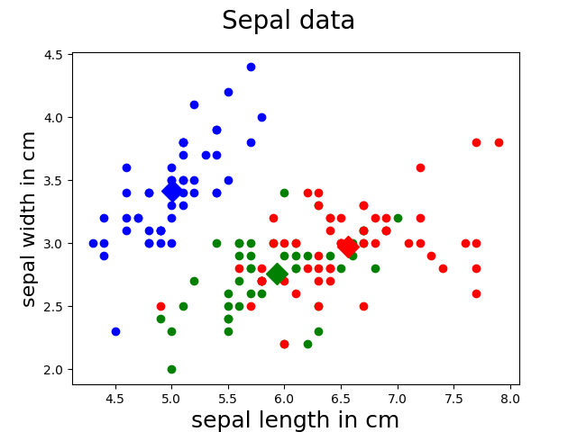
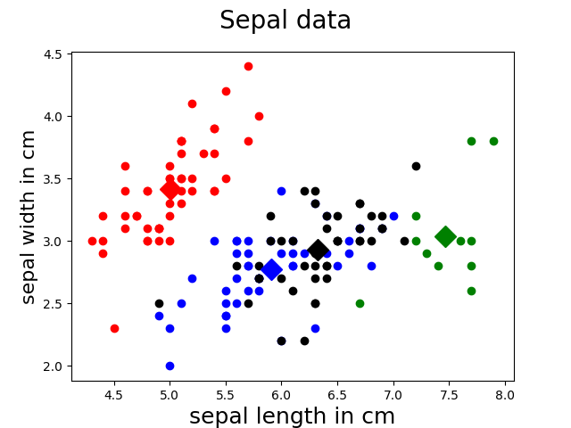

# Implement EM with a Gaussian Mixture Model

## About

This program implements *EM Algorithm* with a *Gaussian mixture model* on the iris data-set (4-dimension), and plot the Sepal data 
points(first two dimensions) based on the obtained clusters.

Andrew Ng's Derivation: http://cs229.stanford.edu/notes/cs229-notes8.pdf

## REQUIREMENTS

*Python* (>= 3.5 recommended) requires

## Run

#### For Mac
    pip3 install install -r requirements.txt
    python3 sol1.py
 
## Result
* for two classes

* for three classes

* for four classes

